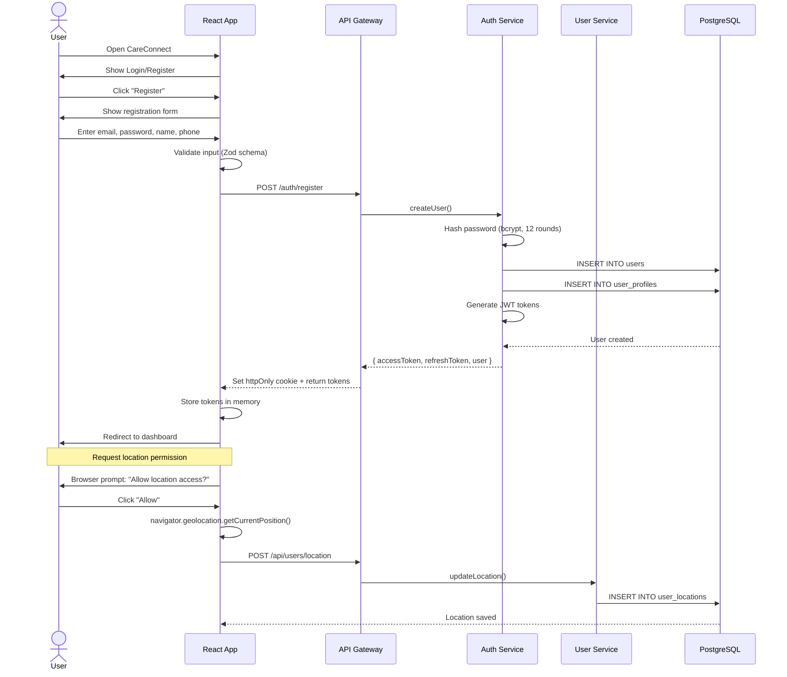
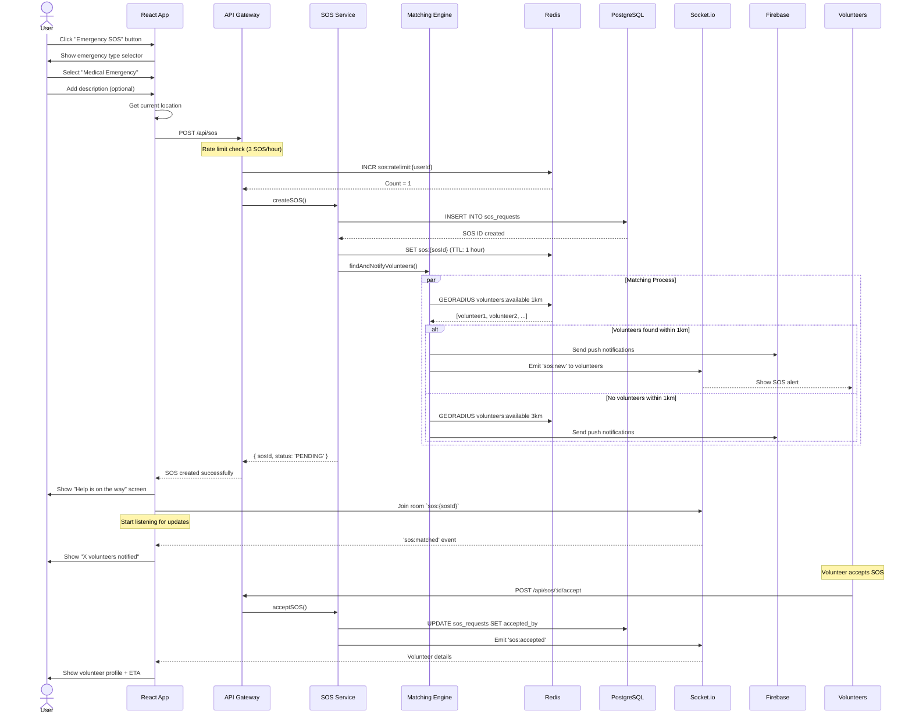
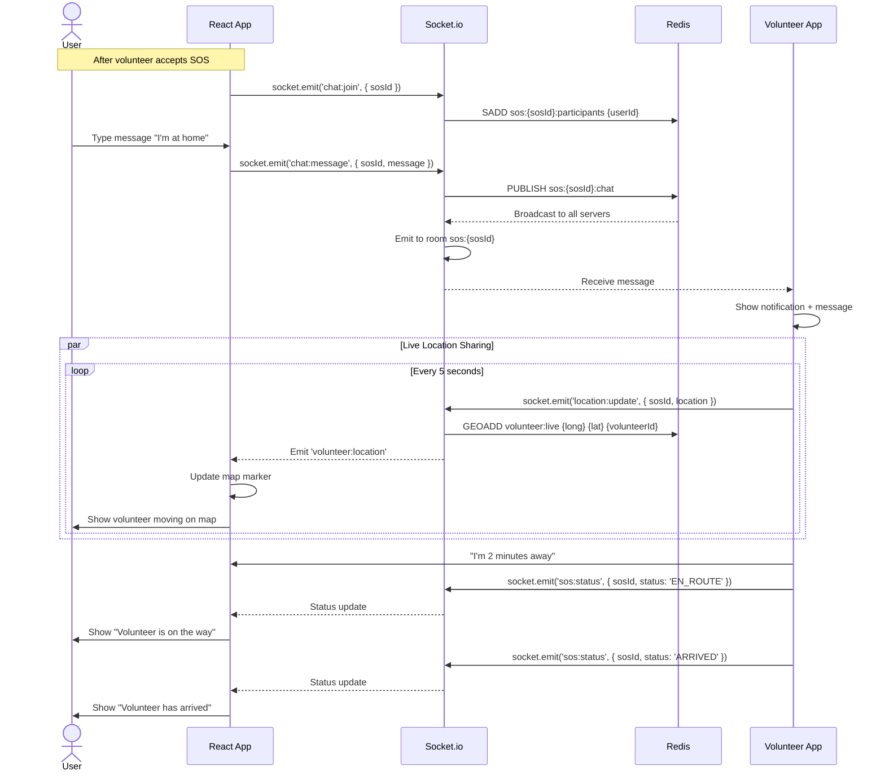
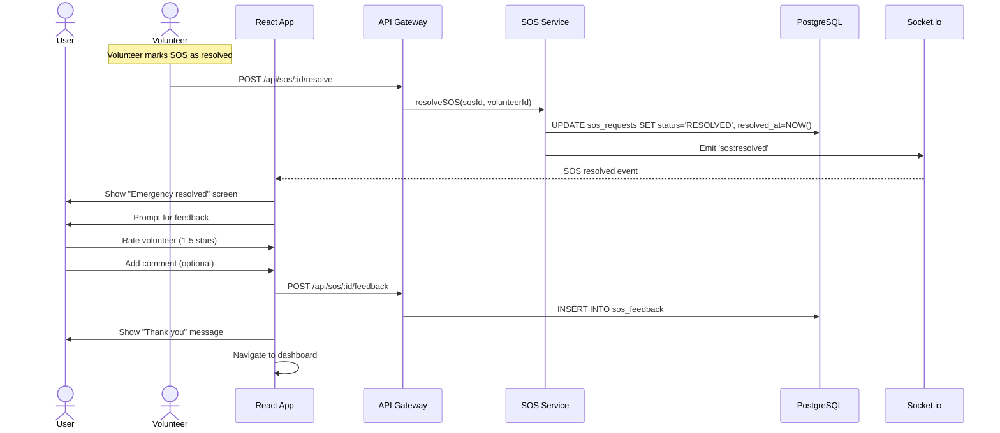
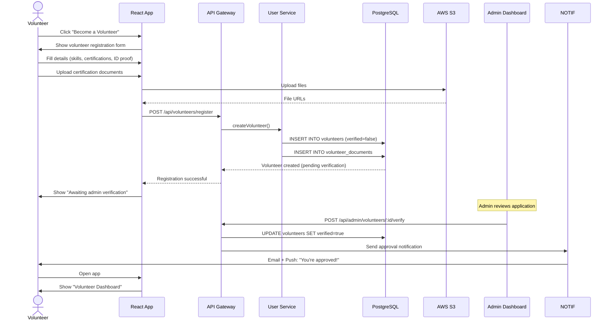
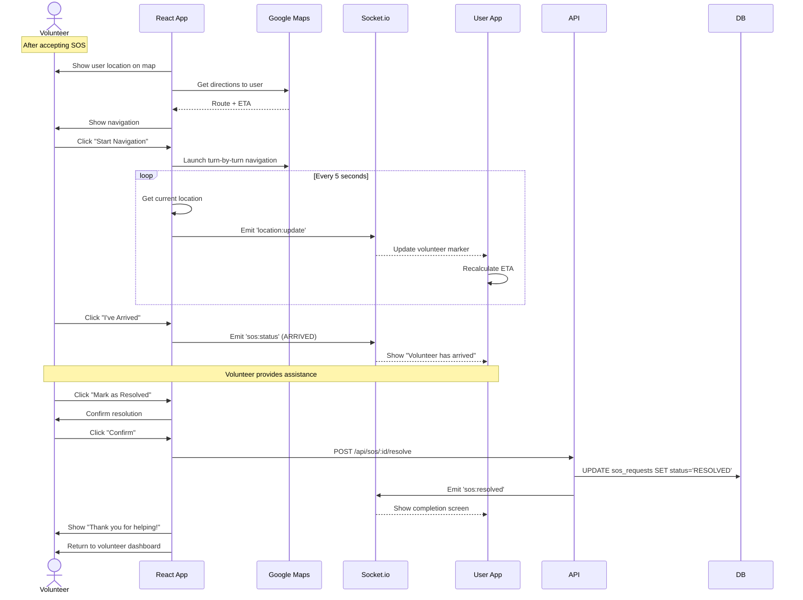
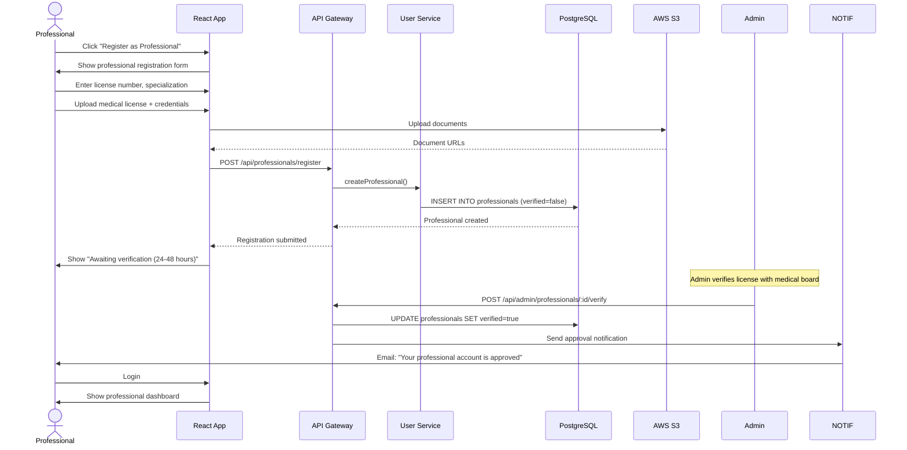
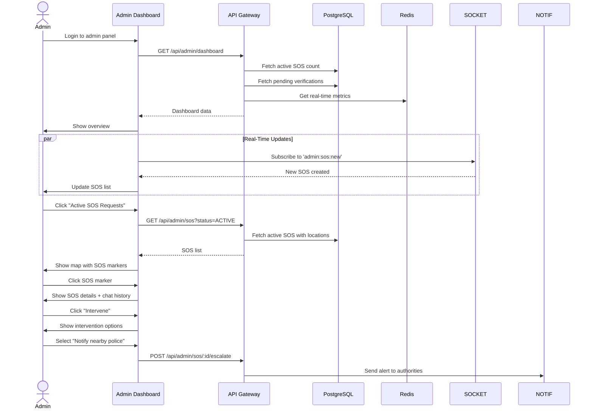

# CareConnect - Detailed User Workflows

## Table of Contents
1. [User Journey (Person in Distress)](#user-journey)
2. [Volunteer Journey](#volunteer-journey)
3. [Professional Journey](#professional-journey)
4. [Admin Journey](#admin-journey)
5. [Edge Cases & Error Handling](#edge-cases)

---

## User Journey (Person in Distress)

### Workflow 1: Registration & Profile Setup



**Key Implementation Details:**

**Frontend Validation (Zod):**
```typescript
import { z } from 'zod';

const registerSchema = z.object({
    email: z.string().email('Invalid email address'),
    password: z.string()
        .min(8, 'Password must be at least 8 characters')
        .regex(/[A-Z]/, 'Must contain uppercase letter')
        .regex(/[0-9]/, 'Must contain number'),
    name: z.string().min(2, 'Name must be at least 2 characters'),
    phone: z.string().regex(/^\+?[1-9]\d{9,14}$/, 'Invalid phone number')
});
```

**Backend Registration Endpoint:**
```javascript
// routes/auth.routes.js
router.post('/register', validateSchema(registerSchema), async (req, res) => {
    try {
        const { email, password, name, phone } = req.body;
        
        // Check if user exists
        const existingUser = await db.query(
            'SELECT id FROM users WHERE email = $1',
            [email]
        );
        
        if (existingUser.rows.length > 0) {
            return res.status(409).json({ error: 'Email already registered' });
        }
        
        // Hash password
        const passwordHash = await bcrypt.hash(password, 12);
        
        // Create user (transaction)
        const client = await db.pool.connect();
        try {
            await client.query('BEGIN');
            
            const userResult = await client.query(
                'INSERT INTO users (email, password_hash, role) VALUES ($1, $2, $3) RETURNING id',
                [email, passwordHash, 'USER']
            );
            
            const userId = userResult.rows[0].id;
            
            await client.query(
                'INSERT INTO user_profiles (user_id, name, phone) VALUES ($1, $2, $3)',
                [userId, name, phone]
            );
            
            await client.query('COMMIT');
            
            // Generate tokens
            const accessToken = jwt.sign(
                { userId, role: 'USER' },
                process.env.JWT_ACCESS_SECRET,
                { expiresIn: '15m' }
            );
            
            const refreshToken = jwt.sign(
                { userId },
                process.env.JWT_REFRESH_SECRET,
                { expiresIn: '7d' }
            );
            
            // Store refresh token
            await db.query(
                'INSERT INTO refresh_tokens (user_id, token_hash, expires_at) VALUES ($1, $2, $3)',
                [userId, await bcrypt.hash(refreshToken, 10), new Date(Date.now() + 7 * 24 * 60 * 60 * 1000)]
            );
            
            res.json({ accessToken, refreshToken, user: { id: userId, email, name, role: 'USER' } });
            
        } catch (error) {
            await client.query('ROLLBACK');
            throw error;
        } finally {
            client.release();
        }
        
    } catch (error) {
        logger.error('Registration error', error);
        res.status(500).json({ error: 'Registration failed' });
    }
});
```

---

### Workflow 2: Creating an SOS Request



**Frontend SOS Creation:**
```typescript
// components/EmergencyButton.tsx
import { useState } from 'react';
import { useGeolocation } from '../hooks/useGeolocation';
import { createSOS } from '../api/sos';

export function EmergencyButton() {
    const [isCreating, setIsCreating] = useState(false);
    const { location, error: locationError } = useGeolocation();
    
    const handleEmergency = async (type: string) => {
        if (!location) {
            alert('Location access required for emergency requests');
            return;
        }
        
        setIsCreating(true);
        
        try {
            const sos = await createSOS({
                emergencyType: type,
                location: {
                    latitude: location.latitude,
                    longitude: location.longitude,
                    accuracy: location.accuracy
                },
                description: '' // Optional user input
            });
            
            // Navigate to SOS tracking screen
            navigate(`/sos/${sos.id}`);
            
        } catch (error) {
            if (error.response?.status === 429) {
                alert('You have reached the maximum SOS requests. Please wait.');
            } else {
                alert('Failed to create SOS. Please try again.');
            }
        } finally {
            setIsCreating(false);
        }
    };
    
    return (
        <div className="emergency-panel">
            <button 
                onClick={() => handleEmergency('MEDICAL')}
                disabled={isCreating || !location}
                className="emergency-btn medical"
            >
                🏥 Medical Emergency
            </button>
            <button onClick={() => handleEmergency('FIRE')} className="emergency-btn fire">
                🔥 Fire
            </button>
            <button onClick={() => handleEmergency('ACCIDENT')} className="emergency-btn accident">
                🚗 Accident
            </button>
            <button onClick={() => handleEmergency('CRIME')} className="emergency-btn crime">
                🚨 Crime
            </button>
        </div>
    );
}
```

**Backend SOS Creation:**
```javascript
// services/sos.service.js
class SOSService {
    async createSOS(userId, { emergencyType, location, description }) {
        // Validate location
        if (!this.isValidLocation(location)) {
            throw new Error('Invalid location coordinates');
        }
        
        // Create SOS request
        const result = await db.query(`
            INSERT INTO sos_requests (
                user_id, emergency_type, priority, location, description, status
            ) VALUES ($1, $2, $3, ST_SetSRID(ST_MakePoint($4, $5), 4326), $6, 'PENDING')
            RETURNING id, created_at
        `, [
            userId,
            emergencyType,
            this.calculatePriority(emergencyType),
            location.longitude,
            location.latitude,
            description
        ]);
        
        const sosId = result.rows[0].id;
        
        // Cache in Redis (1 hour TTL)
        await redis.setex(
            `sos:${sosId}`,
            3600,
            JSON.stringify({ userId, emergencyType, location, status: 'PENDING' })
        );
        
        // Trigger matching engine (async)
        this.matchingEngine.findAndNotifyVolunteers(sosId, location, emergencyType);
        
        // Set auto-escalation timer (2 minutes)
        setTimeout(() => this.checkAndEscalate(sosId), 120000);
        
        return { id: sosId, status: 'PENDING', createdAt: result.rows[0].created_at };
    }
    
    calculatePriority(emergencyType) {
        const priorities = {
            MEDICAL: 'CRITICAL',
            FIRE: 'CRITICAL',
            ACCIDENT: 'HIGH',
            CRIME: 'HIGH',
            NATURAL_DISASTER: 'CRITICAL',
            OTHER: 'MEDIUM'
        };
        return priorities[emergencyType] || 'MEDIUM';
    }
    
    isValidLocation(location) {
        const { latitude, longitude } = location;
        return (
            latitude >= -90 && latitude <= 90 &&
            longitude >= -180 && longitude <= 180
        );
    }
    
    async checkAndEscalate(sosId) {
        const sos = await db.query(
            'SELECT status FROM sos_requests WHERE id = $1',
            [sosId]
        );
        
        if (sos.rows[0]?.status === 'PENDING') {
            logger.warn(`SOS ${sosId} not accepted after 2 minutes - escalating`);
            await this.matchingEngine.escalate(sosId);
        }
    }
}
```

---

### Workflow 3: Real-Time Communication with Volunteer



**Frontend Real-Time Chat:**
```typescript
// components/SOSChat.tsx
import { useEffect, useState } from 'react';
import { useSocket } from '../hooks/useSocket';

export function SOSChat({ sosId }: { sosId: string }) {
    const socket = useSocket();
    const [messages, setMessages] = useState<Message[]>([]);
    const [inputValue, setInputValue] = useState('');
    
    useEffect(() => {
        // Join SOS room
        socket.emit('chat:join', { sosId });
        
        // Listen for messages
        socket.on('chat:message', (message: Message) => {
            setMessages(prev => [...prev, message]);
        });
        
        // Listen for volunteer location
        socket.on('volunteer:location', (data) => {
            updateVolunteerMarker(data.location);
            calculateETA(data.location);
        });
        
        // Listen for status updates
        socket.on('sos:status', (data) => {
            showStatusNotification(data.status);
        });
        
        return () => {
            socket.off('chat:message');
            socket.off('volunteer:location');
            socket.off('sos:status');
        };
    }, [sosId]);
    
    const sendMessage = () => {
        if (!inputValue.trim()) return;
        
        socket.emit('chat:message', {
            sosId,
            message: inputValue,
            timestamp: new Date().toISOString()
        });
        
        setInputValue('');
    };
    
    return (
        <div className="chat-container">
            <div className="messages">
                {messages.map((msg, idx) => (
                    <div key={idx} className={`message ${msg.senderId === currentUserId ? 'sent' : 'received'}`}>
                        <p>{msg.content}</p>
                        <span className="timestamp">{formatTime(msg.timestamp)}</span>
                    </div>
                ))}
            </div>
            <div className="input-area">
                <input
                    value={inputValue}
                    onChange={(e) => setInputValue(e.target.value)}
                    onKeyPress={(e) => e.key === 'Enter' && sendMessage()}
                    placeholder="Type a message..."
                />
                <button onClick={sendMessage}>Send</button>
            </div>
        </div>
    );
}
```

**Backend Socket.io Handlers:**
```javascript
// sockets/sos.socket.js
module.exports = (io) => {
    io.on('connection', (socket) => {
        const userId = socket.handshake.auth.userId;
        
        // Join SOS room
        socket.on('chat:join', async ({ sosId }) => {
            // Verify user is part of this SOS
            const sos = await db.query(
                'SELECT user_id, accepted_by FROM sos_requests WHERE id = $1',
                [sosId]
            );
            
            if (sos.rows[0]?.user_id === userId || sos.rows[0]?.accepted_by === userId) {
                socket.join(`sos:${sosId}`);
                await redis.sadd(`sos:${sosId}:participants`, userId);
            }
        });
        
        // Handle chat messages
        socket.on('chat:message', async ({ sosId, message }) => {
            const chatMessage = {
                sosId,
                senderId: userId,
                content: message,
                timestamp: new Date().toISOString()
            };
            
            // Save to database
            await db.query(
                'INSERT INTO chat_messages (sos_id, sender_id, content) VALUES ($1, $2, $3)',
                [sosId, userId, message]
            );
            
            // Broadcast to room
            io.to(`sos:${sosId}`).emit('chat:message', chatMessage);
        });
        
        // Handle location updates (volunteers only)
        socket.on('location:update', async ({ sosId, location }) => {
            // Update Redis geo index
            await redis.geoadd(
                'volunteer:live',
                location.longitude,
                location.latitude,
                userId
            );
            
            // Broadcast to SOS room
            io.to(`sos:${sosId}`).emit('volunteer:location', {
                volunteerId: userId,
                location,
                timestamp: new Date().toISOString()
            });
        });
        
        // Handle status updates
        socket.on('sos:status', async ({ sosId, status }) => {
            await db.query(
                'UPDATE sos_requests SET status = $1 WHERE id = $2',
                [status, sosId]
            );
            
            io.to(`sos:${sosId}`).emit('sos:status', { sosId, status });
        });
    });
};
```

---

### Workflow 4: Resolving SOS



**Feedback System:**
```javascript
// routes/sos.routes.js
router.post('/:id/feedback', authenticate, async (req, res) => {
    const { id: sosId } = req.params;
    const { rating, comment } = req.body;
    const userId = req.user.id;
    
    // Verify user is the SOS creator
    const sos = await db.query(
        'SELECT user_id, accepted_by FROM sos_requests WHERE id = $1',
        [sosId]
    );
    
    if (sos.rows[0]?.user_id !== userId) {
        return res.status(403).json({ error: 'Unauthorized' });
    }
    
    const volunteerId = sos.rows[0].accepted_by;
    
    // Save feedback
    await db.query(
        'INSERT INTO sos_feedback (sos_id, volunteer_id, rating, comment) VALUES ($1, $2, $3, $4)',
        [sosId, volunteerId, rating, comment]
    );
    
    // Update volunteer average rating
    await db.query(`
        UPDATE volunteers SET average_rating = (
            SELECT AVG(rating) FROM sos_feedback WHERE volunteer_id = $1
        ) WHERE user_id = $1
    `, [volunteerId]);
    
    res.json({ success: true });
});
```

---

## Volunteer Journey

### Workflow 5: Volunteer Registration & Verification



**Volunteer Registration Schema:**
```typescript
const volunteerSchema = z.object({
    skills: z.array(z.enum([
        'FIRST_AID',
        'CPR',
        'FIREFIGHTING',
        'SEARCH_RESCUE',
        'COUNSELING',
        'MEDICAL_PROFESSIONAL',
        'OTHER'
    ])).min(1),
    certifications: z.array(z.object({
        name: z.string(),
        issuedBy: z.string(),
        expiryDate: z.string().optional()
    })),
    idProof: z.object({
        type: z.enum(['DRIVERS_LICENSE', 'PASSPORT', 'NATIONAL_ID']),
        number: z.string(),
        documentUrl: z.string().url()
    }),
    emergencyContact: z.object({
        name: z.string(),
        phone: z.string(),
        relationship: z.string()
    })
});
```

---

### Workflow 6: Receiving & Accepting SOS Alerts

```mermaid
sequenceDiagram
    actor V as Volunteer
    participant APP as React App
    participant FCM as Firebase
    participant SOCKET as Socket.io
    participant API as API Gateway
    participant SOS as SOS Service
    participant DB as PostgreSQL
    
    Note over V: Volunteer has app open + location enabled
    
    FCM->>APP: Push notification: "Emergency nearby!"
    APP->>V: Show SOS alert card
    V->>APP: Tap notification
    APP->>V: Show SOS details (type, distance, user info)
    
    par Volunteer Decision
        V->>APP: Click "Accept"
        APP->>API: POST /api/sos/:id/accept
        API->>SOS: acceptSOS(sosId, volunteerId)
        
        alt SOS still available
            SOS->>DB: UPDATE sos_requests SET accepted_by=$1, status='ACCEPTED'
            SOS->>SOCKET: Emit 'sos:accepted' to user
            SOS->>SOCKET: Emit 'sos:taken' to other volunteers
            SOS-->>API: Success
            API-->>APP: SOS accepted
            APP->>V: Navigate to active SOS screen
        else SOS already accepted by another volunteer
            SOS-->>API: Error: SOS no longer available
            API-->>APP: 409 Conflict
            APP->>V: Show "This SOS was already accepted"
        end
    or
        V->>APP: Click "Reject"
        APP->>API: POST /api/sos/:id/reject
        API->>DB: INSERT INTO sos_rejections (sos_id, volunteer_id)
        APP->>V: Dismiss alert
    end
```

**Optimistic Locking for SOS Acceptance:**
```javascript
// services/sos.service.js
async acceptSOS(sosId, volunteerId) {
    const client = await db.pool.connect();
    
    try {
        await client.query('BEGIN');
        
        // Lock the row and check if still available
        const result = await client.query(
            `UPDATE sos_requests 
             SET accepted_by = $1, 
                 accepted_at = NOW(), 
                 status = 'ACCEPTED'
             WHERE id = $2 
               AND status = 'PENDING' 
               AND accepted_by IS NULL
             RETURNING id, user_id`,
            [volunteerId, sosId]
        );
        
        if (result.rows.length === 0) {
            await client.query('ROLLBACK');
            throw new Error('SOS_ALREADY_ACCEPTED');
        }
        
        const userId = result.rows[0].user_id;
        
        // Update volunteer status
        await client.query(
            'UPDATE volunteers SET available = false WHERE user_id = $1',
            [volunteerId]
        );
        
        await client.query('COMMIT');
        
        // Notify user via Socket.io
        io.to(`user:${userId}`).emit('sos:accepted', {
            sosId,
            volunteer: await this.getVolunteerProfile(volunteerId)
        });
        
        // Notify other volunteers that SOS is taken
        io.to(`sos:${sosId}:pending`).emit('sos:taken', { sosId });
        
        return { success: true };
        
    } catch (error) {
        await client.query('ROLLBACK');
        throw error;
    } finally {
        client.release();
    }
}
```

---

### Workflow 7: Navigating to User & Providing Help



---

## Professional Journey

### Workflow 8: Professional Registration (Doctors, Paramedics)



**Professional-Specific Features:**
- **Priority Matching**: Professionals get notified first for medical emergencies
- **Consultation Mode**: Can provide remote guidance via video call
- **Liability Protection**: Legal disclaimer + insurance verification

---

## Admin Journey

### Workflow 9: Admin Monitoring Dashboard



**Admin Dashboard Metrics:**
```javascript
// routes/admin.routes.js
router.get('/dashboard', authenticateAdmin, async (req, res) => {
    const metrics = await Promise.all([
        // Active SOS count
        db.query("SELECT COUNT(*) FROM sos_requests WHERE status IN ('PENDING', 'ACCEPTED', 'IN_PROGRESS')"),
        
        // Average response time (last 24 hours)
        db.query(`
            SELECT AVG(EXTRACT(EPOCH FROM (accepted_at - created_at))) AS avg_response_time
            FROM sos_requests
            WHERE created_at > NOW() - INTERVAL '24 hours'
              AND accepted_at IS NOT NULL
        `),
        
        // Available volunteers by region
        db.query(`
            SELECT 
                ST_AsGeoJSON(location) AS region,
                COUNT(*) AS volunteer_count
            FROM user_locations ul
            JOIN volunteers v ON ul.user_id = v.user_id
            WHERE v.available = true
            GROUP BY ST_SnapToGrid(location, 0.1)
        `),
        
        // Pending verifications
        db.query("SELECT COUNT(*) FROM volunteers WHERE verified = false"),
        
        // Resolution rate (last 7 days)
        db.query(`
            SELECT 
                COUNT(CASE WHEN status = 'RESOLVED' THEN 1 END)::FLOAT / COUNT(*) AS resolution_rate
            FROM sos_requests
            WHERE created_at > NOW() - INTERVAL '7 days'
        `)
    ]);
    
    res.json({
        activeSOS: metrics[0].rows[0].count,
        avgResponseTime: metrics[1].rows[0].avg_response_time,
        volunteersByRegion: metrics[2].rows,
        pendingVerifications: metrics[3].rows[0].count,
        resolutionRate: metrics[4].rows[0].resolution_rate
    });
});
```

---

## Edge Cases & Error Handling

### Edge Case 1: No Volunteers Available

**Scenario:** User creates SOS but no volunteers are available within 10km.

**Handling:**
```javascript
async function handleNoVolunteersAvailable(sosId) {
    // 1. Notify admins immediately
    await notifyAdmins({
        type: 'NO_VOLUNTEERS',
        sosId,
        message: 'SOS created but no volunteers available'
    });
    
    // 2. Send SMS to user with emergency hotline numbers
    const sos = await db.query('SELECT user_id FROM sos_requests WHERE id = $1', [sosId]);
    const user = await getUserProfile(sos.rows[0].user_id);
    
    await twilio.messages.create({
        to: user.phone,
        body: `We're working to find help. In the meantime, call emergency services: 911 (Police), 101 (Fire)`
    });
    
    // 3. Expand search to professionals (even if off-duty)
    const professionals = await findNearbyProfessionals(sosLocation, 20000); // 20km radius
    await notifyProfessionals(professionals, sosId);
    
    // 4. Mark SOS as escalated
    await db.query(
        'UPDATE sos_requests SET status = $1 WHERE id = $2',
        ['ESCALATED', sosId]
    );
}
```

---

### Edge Case 2: Volunteer Cancels After Accepting

**Scenario:** Volunteer accepts SOS but cancels mid-way.

**Handling:**
```javascript
router.post('/:id/cancel', authenticate, async (req, res) => {
    const { id: sosId } = req.params;
    const volunteerId = req.user.id;
    const { reason } = req.body;
    
    // Verify volunteer is assigned to this SOS
    const sos = await db.query(
        'SELECT accepted_by, status FROM sos_requests WHERE id = $1',
        [sosId]
    );
    
    if (sos.rows[0]?.accepted_by !== volunteerId) {
        return res.status(403).json({ error: 'Unauthorized' });
    }
    
    // Log cancellation
    await db.query(
        'INSERT INTO sos_cancellations (sos_id, volunteer_id, reason) VALUES ($1, $2, $3)',
        [sosId, volunteerId, reason]
    );
    
    // Reset SOS to pending
    await db.query(
        'UPDATE sos_requests SET accepted_by = NULL, status = $1 WHERE id = $2',
        ['PENDING', sosId]
    );
    
    // Notify user
    io.to(`sos:${sosId}`).emit('volunteer:cancelled', {
        message: 'Volunteer cancelled. Finding another helper...'
    });
    
    // Re-trigger matching
    await matchingEngine.findAndNotifyVolunteers(sosId);
    
    // Penalize volunteer (reduce priority for future SOS)
    await db.query(
        'UPDATE volunteers SET cancellation_count = cancellation_count + 1 WHERE user_id = $1',
        [volunteerId]
    );
    
    res.json({ success: true });
});
```

---

### Edge Case 3: User Location Spoofing

**Scenario:** User tries to create SOS with fake location.

**Prevention:**
```javascript
async function validateLocation(claimedLocation, ipAddress) {
    // Get approximate location from IP
    const ipLocation = await geoip.lookup(ipAddress);
    
    // Calculate distance between claimed and IP-based location
    const distance = calculateDistance(
        claimedLocation,
        { lat: ipLocation.latitude, lng: ipLocation.longitude }
    );
    
    // Allow up to 50km difference (accounts for VPNs, mobile networks)
    if (distance > 50000) {
        logger.warn('Potential location spoofing', {
            claimedLocation,
            ipLocation,
            distance
        });
        
        // Flag for admin review but don't block (false positives possible)
        await db.query(
            'INSERT INTO suspicious_activities (user_id, type, details) VALUES ($1, $2, $3)',
            [userId, 'LOCATION_MISMATCH', JSON.stringify({ distance })]
        );
    }
    
    return true; // Allow SOS creation but flag for review
}
```

---

### Edge Case 4: Network Disconnection During Active SOS

**Frontend Reconnection Logic:**
```typescript
// hooks/useSocket.ts
export function useSocket() {
    const socket = useRef<Socket>();
    
    useEffect(() => {
        socket.current = io(SOCKET_URL, {
            auth: { token: getAccessToken() },
            reconnection: true,
            reconnectionAttempts: 5,
            reconnectionDelay: 1000,
            reconnectionDelayMax: 5000
        });
        
        socket.current.on('connect', () => {
            console.log('Connected to server');
            
            // Rejoin active SOS room if exists
            const activeSOS = localStorage.getItem('activeSOS');
            if (activeSOS) {
                socket.current.emit('chat:join', { sosId: activeSOS });
            }
        });
        
        socket.current.on('disconnect', () => {
            console.log('Disconnected from server');
            showNotification('Connection lost. Reconnecting...');
        });
        
        socket.current.on('connect_error', (error) => {
            console.error('Connection error', error);
            showNotification('Unable to connect. Check your internet.');
        });
        
        return () => {
            socket.current?.disconnect();
        };
    }, []);
    
    return socket.current;
}
```

---

**Document Version:** 1.0  
**Last Updated:** 2025-12-18
