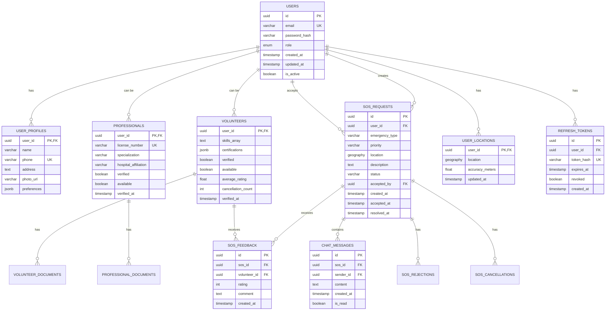

# CareConnect - Database Schema Design

## Table of Contents
1. [Entity Relationship Diagram](#erd)
2. [Table Definitions](#tables)
3. [Indexes & Constraints](#indexes)
4. [Sample Queries](#queries)
5. [Migration Strategy](#migrations)

---

## Entity Relationship Diagram



---

## Table Definitions

### 1. users

**Purpose:** Core authentication and user identity

```sql
CREATE TABLE users (
    id UUID PRIMARY KEY DEFAULT gen_random_uuid(),
    email VARCHAR(255) UNIQUE NOT NULL,
    password_hash VARCHAR(255) NOT NULL,
    role VARCHAR(20) NOT NULL CHECK (role IN ('USER', 'VOLUNTEER', 'PROFESSIONAL', 'ADMIN')),
    is_active BOOLEAN DEFAULT true,
    created_at TIMESTAMP DEFAULT NOW(),
    updated_at TIMESTAMP DEFAULT NOW()
);

CREATE INDEX idx_users_email ON users(email);
CREATE INDEX idx_users_role ON users(role) WHERE is_active = true;
```

**WHY UUID for Primary Key:**
- Prevents enumeration attacks (can't guess user IDs)
- Enables distributed ID generation
- No sequential ID leakage

---

### 2. user_profiles

**Purpose:** User personal information

```sql
CREATE TABLE user_profiles (
    user_id UUID PRIMARY KEY REFERENCES users(id) ON DELETE CASCADE,
    name VARCHAR(255) NOT NULL,
    phone VARCHAR(20) UNIQUE NOT NULL,
    address TEXT,
    photo_url VARCHAR(500),
    preferences JSONB DEFAULT '{}',
    created_at TIMESTAMP DEFAULT NOW(),
    updated_at TIMESTAMP DEFAULT NOW()
);

CREATE INDEX idx_user_profiles_phone ON user_profiles(phone);
```

**JSONB preferences structure:**
```json
{
    "language": "en",
    "notificationPreferences": {
        "push": true,
        "sms": false,
        "email": true
    },
    "emergencyContacts": [
        {
            "name": "John Doe",
            "phone": "+1234567890",
            "relationship": "Spouse"
        }
    ]
}
```

---

### 3. volunteers

**Purpose:** Volunteer-specific data and verification status

```sql
CREATE TABLE volunteers (
    user_id UUID PRIMARY KEY REFERENCES users(id) ON DELETE CASCADE,
    skills TEXT[] NOT NULL DEFAULT '{}',
    certifications JSONB DEFAULT '[]',
    verified BOOLEAN DEFAULT false,
    available BOOLEAN DEFAULT false,
    average_rating DECIMAL(3,2) DEFAULT 0.00 CHECK (average_rating >= 0 AND average_rating <= 5),
    cancellation_count INT DEFAULT 0,
    verified_at TIMESTAMP,
    verified_by UUID REFERENCES users(id),
    created_at TIMESTAMP DEFAULT NOW(),
    updated_at TIMESTAMP DEFAULT NOW()
);

CREATE INDEX idx_volunteers_verified ON volunteers(verified) WHERE verified = true;
CREATE INDEX idx_volunteers_available ON volunteers(available) WHERE available = true AND verified = true;
CREATE INDEX idx_volunteers_rating ON volunteers(average_rating DESC);
```

**Skills Array Values:**
```sql
-- Enum-like constraint
ALTER TABLE volunteers ADD CONSTRAINT valid_skills CHECK (
    skills <@ ARRAY[
        'FIRST_AID',
        'CPR',
        'FIREFIGHTING',
        'SEARCH_RESCUE',
        'COUNSELING',
        'MEDICAL_PROFESSIONAL',
        'DRIVER',
        'TRANSLATOR',
        'OTHER'
    ]::TEXT[]
);
```

**Certifications JSONB structure:**
```json
[
    {
        "name": "CPR Certification",
        "issuedBy": "American Red Cross",
        "issueDate": "2023-01-15",
        "expiryDate": "2025-01-15",
        "documentUrl": "https://s3.../cert.pdf"
    }
]
```

---

### 4. professionals

**Purpose:** Medical professionals (doctors, paramedics, nurses)

```sql
CREATE TABLE professionals (
    user_id UUID PRIMARY KEY REFERENCES users(id) ON DELETE CASCADE,
    license_number VARCHAR(100) UNIQUE NOT NULL,
    specialization VARCHAR(100) NOT NULL,
    hospital_affiliation VARCHAR(255),
    verified BOOLEAN DEFAULT false,
    available BOOLEAN DEFAULT false,
    verified_at TIMESTAMP,
    verified_by UUID REFERENCES users(id),
    created_at TIMESTAMP DEFAULT NOW(),
    updated_at TIMESTAMP DEFAULT NOW()
);

CREATE INDEX idx_professionals_verified ON professionals(verified) WHERE verified = true;
CREATE INDEX idx_professionals_specialization ON professionals(specialization);
```

---

### 5. user_locations

**Purpose:** Real-time location tracking with PostGIS

```sql
-- Enable PostGIS extension
CREATE EXTENSION IF NOT EXISTS postgis;

CREATE TABLE user_locations (
    user_id UUID PRIMARY KEY REFERENCES users(id) ON DELETE CASCADE,
    location GEOGRAPHY(POINT, 4326) NOT NULL,
    accuracy_meters FLOAT,
    updated_at TIMESTAMP DEFAULT NOW()
);

-- Spatial index for geo-queries
CREATE INDEX idx_user_locations_gist ON user_locations USING GIST(location);
```

**WHY GEOGRAPHY vs GEOMETRY:**
- `GEOGRAPHY`: Uses spherical earth model (accurate for global distances)
- `GEOMETRY`: Uses flat plane (faster but less accurate over long distances)
- For emergency response, accuracy matters more than speed

**Sample Geo-Query:**
```sql
-- Find volunteers within 5km of emergency location
SELECT 
    v.user_id,
    up.name,
    ST_Distance(ul.location, ST_SetSRID(ST_MakePoint(-122.4194, 37.7749), 4326)) AS distance_meters
FROM user_locations ul
JOIN volunteers v ON ul.user_id = v.user_id
JOIN user_profiles up ON ul.user_id = up.user_id
WHERE v.available = true
  AND v.verified = true
  AND ST_DWithin(
      ul.location,
      ST_SetSRID(ST_MakePoint(-122.4194, 37.7749), 4326)::geography,
      5000  -- 5km radius
  )
ORDER BY distance_meters ASC
LIMIT 10;
```

---

### 6. sos_requests

**Purpose:** Emergency SOS requests with lifecycle tracking

```sql
CREATE TABLE sos_requests (
    id UUID PRIMARY KEY DEFAULT gen_random_uuid(),
    user_id UUID NOT NULL REFERENCES users(id),
    emergency_type VARCHAR(50) NOT NULL,
    priority VARCHAR(20) NOT NULL,
    location GEOGRAPHY(POINT, 4326) NOT NULL,
    description TEXT,
    status VARCHAR(20) NOT NULL DEFAULT 'PENDING',
    accepted_by UUID REFERENCES users(id),
    created_at TIMESTAMP DEFAULT NOW(),
    accepted_at TIMESTAMP,
    resolved_at TIMESTAMP,
    
    CONSTRAINT valid_emergency_type CHECK (
        emergency_type IN ('MEDICAL', 'FIRE', 'ACCIDENT', 'CRIME', 'NATURAL_DISASTER', 'OTHER')
    ),
    CONSTRAINT valid_priority CHECK (
        priority IN ('CRITICAL', 'HIGH', 'MEDIUM', 'LOW')
    ),
    CONSTRAINT valid_status CHECK (
        status IN ('PENDING', 'ACCEPTED', 'IN_PROGRESS', 'RESOLVED', 'CANCELLED', 'ESCALATED')
    ),
    CONSTRAINT accepted_at_after_created CHECK (
        accepted_at IS NULL OR accepted_at >= created_at
    ),
    CONSTRAINT resolved_at_after_accepted CHECK (
        resolved_at IS NULL OR resolved_at >= accepted_at
    )
);

-- Indexes for common queries
CREATE INDEX idx_sos_status ON sos_requests(status) WHERE status IN ('PENDING', 'ACCEPTED', 'IN_PROGRESS');
CREATE INDEX idx_sos_user_id ON sos_requests(user_id);
CREATE INDEX idx_sos_accepted_by ON sos_requests(accepted_by);
CREATE INDEX idx_sos_created_at ON sos_requests(created_at DESC);
CREATE INDEX idx_sos_location_gist ON sos_requests USING GIST(location);

-- Composite index for dashboard queries
CREATE INDEX idx_sos_status_created ON sos_requests(status, created_at DESC);
```

---

### 7. chat_messages

**Purpose:** Real-time chat between user and responder

```sql
CREATE TABLE chat_messages (
    id UUID PRIMARY KEY DEFAULT gen_random_uuid(),
    sos_id UUID NOT NULL REFERENCES sos_requests(id) ON DELETE CASCADE,
    sender_id UUID NOT NULL REFERENCES users(id),
    content TEXT NOT NULL,
    is_read BOOLEAN DEFAULT false,
    created_at TIMESTAMP DEFAULT NOW()
);

CREATE INDEX idx_chat_sos_id ON chat_messages(sos_id, created_at ASC);
CREATE INDEX idx_chat_sender_id ON chat_messages(sender_id);
```

---

### 8. sos_feedback

**Purpose:** User ratings and feedback for volunteers

```sql
CREATE TABLE sos_feedback (
    id UUID PRIMARY KEY DEFAULT gen_random_uuid(),
    sos_id UUID NOT NULL REFERENCES sos_requests(id) ON DELETE CASCADE,
    volunteer_id UUID NOT NULL REFERENCES users(id),
    rating INT NOT NULL CHECK (rating >= 1 AND rating <= 5),
    comment TEXT,
    created_at TIMESTAMP DEFAULT NOW(),
    
    UNIQUE(sos_id)  -- One feedback per SOS
);

CREATE INDEX idx_feedback_volunteer ON sos_feedback(volunteer_id);
```

**Trigger to Update Volunteer Average Rating:**
```sql
CREATE OR REPLACE FUNCTION update_volunteer_rating()
RETURNS TRIGGER AS $$
BEGIN
    UPDATE volunteers
    SET average_rating = (
        SELECT AVG(rating)::DECIMAL(3,2)
        FROM sos_feedback
        WHERE volunteer_id = NEW.volunteer_id
    )
    WHERE user_id = NEW.volunteer_id;
    
    RETURN NEW;
END;
$$ LANGUAGE plpgsql;

CREATE TRIGGER trigger_update_volunteer_rating
AFTER INSERT ON sos_feedback
FOR EACH ROW
EXECUTE FUNCTION update_volunteer_rating();
```

---

### 9. sos_rejections

**Purpose:** Track which volunteers rejected which SOS (for analytics)

```sql
CREATE TABLE sos_rejections (
    id UUID PRIMARY KEY DEFAULT gen_random_uuid(),
    sos_id UUID NOT NULL REFERENCES sos_requests(id) ON DELETE CASCADE,
    volunteer_id UUID NOT NULL REFERENCES users(id),
    created_at TIMESTAMP DEFAULT NOW(),
    
    UNIQUE(sos_id, volunteer_id)  -- Prevent duplicate rejections
);

CREATE INDEX idx_rejections_sos ON sos_rejections(sos_id);
CREATE INDEX idx_rejections_volunteer ON sos_rejections(volunteer_id);
```

---

### 10. sos_cancellations

**Purpose:** Track volunteer cancellations after acceptance

```sql
CREATE TABLE sos_cancellations (
    id UUID PRIMARY KEY DEFAULT gen_random_uuid(),
    sos_id UUID NOT NULL REFERENCES sos_requests(id) ON DELETE CASCADE,
    volunteer_id UUID NOT NULL REFERENCES users(id),
    reason TEXT,
    created_at TIMESTAMP DEFAULT NOW()
);

CREATE INDEX idx_cancellations_volunteer ON sos_cancellations(volunteer_id);
```

---

### 11. volunteer_documents

**Purpose:** Store volunteer verification documents

```sql
CREATE TABLE volunteer_documents (
    id UUID PRIMARY KEY DEFAULT gen_random_uuid(),
    volunteer_id UUID NOT NULL REFERENCES volunteers(user_id) ON DELETE CASCADE,
    document_type VARCHAR(50) NOT NULL,
    document_url VARCHAR(500) NOT NULL,
    uploaded_at TIMESTAMP DEFAULT NOW(),
    
    CONSTRAINT valid_document_type CHECK (
        document_type IN ('ID_PROOF', 'CERTIFICATION', 'BACKGROUND_CHECK', 'OTHER')
    )
);

CREATE INDEX idx_volunteer_docs ON volunteer_documents(volunteer_id);
```

---

### 12. professional_documents

**Purpose:** Store professional license documents

```sql
CREATE TABLE professional_documents (
    id UUID PRIMARY KEY DEFAULT gen_random_uuid(),
    professional_id UUID NOT NULL REFERENCES professionals(user_id) ON DELETE CASCADE,
    document_type VARCHAR(50) NOT NULL,
    document_url VARCHAR(500) NOT NULL,
    uploaded_at TIMESTAMP DEFAULT NOW(),
    
    CONSTRAINT valid_document_type CHECK (
        document_type IN ('MEDICAL_LICENSE', 'DEGREE', 'HOSPITAL_ID', 'OTHER')
    )
);

CREATE INDEX idx_professional_docs ON professional_documents(professional_id);
```

---

### 13. refresh_tokens

**Purpose:** JWT refresh token management

```sql
CREATE TABLE refresh_tokens (
    id UUID PRIMARY KEY DEFAULT gen_random_uuid(),
    user_id UUID NOT NULL REFERENCES users(id) ON DELETE CASCADE,
    token_hash VARCHAR(255) UNIQUE NOT NULL,
    expires_at TIMESTAMP NOT NULL,
    revoked BOOLEAN DEFAULT false,
    created_at TIMESTAMP DEFAULT NOW()
);

CREATE INDEX idx_refresh_tokens_user ON refresh_tokens(user_id);
CREATE INDEX idx_refresh_tokens_hash ON refresh_tokens(token_hash) WHERE revoked = false;
CREATE INDEX idx_refresh_tokens_expires ON refresh_tokens(expires_at) WHERE revoked = false;
```

**Cleanup Job (Run Daily):**
```sql
-- Delete expired tokens
DELETE FROM refresh_tokens
WHERE expires_at < NOW() OR revoked = true;
```

---

### 14. suspicious_activities

**Purpose:** Log suspicious activities for admin review

```sql
CREATE TABLE suspicious_activities (
    id UUID PRIMARY KEY DEFAULT gen_random_uuid(),
    user_id UUID REFERENCES users(id),
    activity_type VARCHAR(50) NOT NULL,
    details JSONB,
    ip_address INET,
    created_at TIMESTAMP DEFAULT NOW()
);

CREATE INDEX idx_suspicious_user ON suspicious_activities(user_id);
CREATE INDEX idx_suspicious_type ON suspicious_activities(activity_type);
CREATE INDEX idx_suspicious_created ON suspicious_activities(created_at DESC);
```

**Activity Types:**
- `LOCATION_MISMATCH`: Claimed location far from IP location
- `RATE_LIMIT_EXCEEDED`: Too many SOS requests
- `MULTIPLE_FAILED_LOGINS`: Brute force attempt
- `SPAM_MESSAGES`: Excessive chat messages

---

## Indexes & Performance Optimization

### Composite Indexes for Common Queries

```sql
-- Dashboard: Active SOS by priority
CREATE INDEX idx_sos_active_priority ON sos_requests(status, priority, created_at DESC)
WHERE status IN ('PENDING', 'ACCEPTED', 'IN_PROGRESS');

-- Volunteer matching: Available + verified + location
CREATE INDEX idx_volunteers_matching ON volunteers(available, verified)
WHERE available = true AND verified = true;

-- User SOS history
CREATE INDEX idx_sos_user_history ON sos_requests(user_id, created_at DESC);

-- Volunteer SOS history
CREATE INDEX idx_sos_volunteer_history ON sos_requests(accepted_by, created_at DESC)
WHERE accepted_by IS NOT NULL;
```

### Partial Indexes

**WHY Partial Indexes:**
- Smaller index size (faster queries)
- Only index rows that are frequently queried
- Reduces write overhead

```sql
-- Only index active SOS (not resolved/cancelled)
CREATE INDEX idx_sos_active ON sos_requests(created_at DESC)
WHERE status IN ('PENDING', 'ACCEPTED', 'IN_PROGRESS');

-- Only index available volunteers
CREATE INDEX idx_volunteers_available_location ON volunteers(user_id)
WHERE available = true AND verified = true;
```

---

## Sample Queries

### Query 1: Find Nearby Available Volunteers

```sql
WITH emergency_location AS (
    SELECT ST_SetSRID(ST_MakePoint($1, $2), 4326)::geography AS point
)
SELECT 
    v.user_id,
    up.name,
    up.phone,
    v.skills,
    v.average_rating,
    ST_Distance(ul.location, el.point) AS distance_meters
FROM volunteers v
JOIN user_locations ul ON v.user_id = ul.user_id
JOIN user_profiles up ON v.user_id = up.user_id
CROSS JOIN emergency_location el
WHERE v.available = true
  AND v.verified = true
  AND ST_DWithin(ul.location, el.point, $3)  -- $3 = radius in meters
ORDER BY distance_meters ASC
LIMIT 10;
```

**Parameters:**
- `$1`: Longitude
- `$2`: Latitude
- `$3`: Search radius (e.g., 5000 for 5km)

---

### Query 2: User SOS History with Volunteer Details

```sql
SELECT 
    s.id,
    s.emergency_type,
    s.status,
    s.created_at,
    s.resolved_at,
    EXTRACT(EPOCH FROM (s.resolved_at - s.created_at)) AS duration_seconds,
    vp.name AS volunteer_name,
    f.rating,
    f.comment
FROM sos_requests s
LEFT JOIN user_profiles vp ON s.accepted_by = vp.user_id
LEFT JOIN sos_feedback f ON s.id = f.sos_id
WHERE s.user_id = $1
ORDER BY s.created_at DESC
LIMIT 20;
```

---

### Query 3: Admin Dashboard - Active SOS Map Data

```sql
SELECT 
    s.id,
    s.emergency_type,
    s.priority,
    s.status,
    ST_X(s.location::geometry) AS longitude,
    ST_Y(s.location::geometry) AS latitude,
    up.name AS user_name,
    up.phone AS user_phone,
    s.created_at,
    EXTRACT(EPOCH FROM (NOW() - s.created_at)) AS elapsed_seconds,
    vp.name AS volunteer_name
FROM sos_requests s
JOIN user_profiles up ON s.user_id = up.user_id
LEFT JOIN user_profiles vp ON s.accepted_by = vp.user_id
WHERE s.status IN ('PENDING', 'ACCEPTED', 'IN_PROGRESS')
ORDER BY s.priority DESC, s.created_at ASC;
```

---

### Query 4: Volunteer Performance Analytics

```sql
SELECT 
    v.user_id,
    up.name,
    v.average_rating,
    COUNT(s.id) AS total_sos_handled,
    COUNT(CASE WHEN s.status = 'RESOLVED' THEN 1 END) AS resolved_count,
    AVG(EXTRACT(EPOCH FROM (s.accepted_at - s.created_at))) AS avg_response_time_sec,
    v.cancellation_count
FROM volunteers v
JOIN user_profiles up ON v.user_id = up.user_id
LEFT JOIN sos_requests s ON v.user_id = s.accepted_by
WHERE v.verified = true
GROUP BY v.user_id, up.name, v.average_rating, v.cancellation_count
ORDER BY v.average_rating DESC, total_sos_handled DESC;
```

---

## Database Partitioning Strategy

**WHY Partition:**
- Improve query performance on large tables
- Easier archival of old data
- Faster index rebuilds

### Partition sos_requests by Month

```sql
-- Convert to partitioned table
CREATE TABLE sos_requests_partitioned (
    LIKE sos_requests INCLUDING ALL
) PARTITION BY RANGE (created_at);

-- Create partitions for each month
CREATE TABLE sos_requests_2025_01 PARTITION OF sos_requests_partitioned
FOR VALUES FROM ('2025-01-01') TO ('2025-02-01');

CREATE TABLE sos_requests_2025_02 PARTITION OF sos_requests_partitioned
FOR VALUES FROM ('2025-02-01') TO ('2025-03-01');

-- Auto-create future partitions (using pg_partman extension)
SELECT create_parent('public.sos_requests_partitioned', 'created_at', 'native', 'monthly');
```

---

## Migration Strategy

### Phase 1: Initial Schema Setup

```sql
-- migrations/001_initial_schema.sql
BEGIN;

-- Create extensions
CREATE EXTENSION IF NOT EXISTS "uuid-ossp";
CREATE EXTENSION IF NOT EXISTS "postgis";

-- Create tables in dependency order
\i tables/users.sql
\i tables/user_profiles.sql
\i tables/volunteers.sql
\i tables/professionals.sql
\i tables/user_locations.sql
\i tables/sos_requests.sql
\i tables/chat_messages.sql
\i tables/sos_feedback.sql
\i tables/refresh_tokens.sql

-- Create indexes
\i indexes/users.sql
\i indexes/sos_requests.sql

-- Create triggers
\i triggers/update_volunteer_rating.sql

COMMIT;
```

### Phase 2: Seed Data (Development)

```sql
-- migrations/002_seed_data.sql
BEGIN;

-- Create admin user
INSERT INTO users (id, email, password_hash, role)
VALUES (
    '00000000-0000-0000-0000-000000000001',
    'admin@careconnect.com',
    '$2b$12$...',  -- bcrypt hash of 'admin123'
    'ADMIN'
);

-- Create test volunteers
INSERT INTO users (email, password_hash, role) VALUES
    ('volunteer1@test.com', '$2b$12$...', 'VOLUNTEER'),
    ('volunteer2@test.com', '$2b$12$...', 'VOLUNTEER');

COMMIT;
```

### Migration Tool (Node.js)

```javascript
// scripts/migrate.js
const { Pool } = require('pg');
const fs = require('fs');
const path = require('path');

const pool = new Pool({ connectionString: process.env.DATABASE_URL });

async function runMigrations() {
    const migrationsDir = path.join(__dirname, '../migrations');
    const files = fs.readdirSync(migrationsDir).sort();
    
    for (const file of files) {
        if (!file.endsWith('.sql')) continue;
        
        console.log(`Running migration: ${file}`);
        const sql = fs.readFileSync(path.join(migrationsDir, file), 'utf8');
        
        try {
            await pool.query(sql);
            console.log(`✓ ${file} completed`);
        } catch (error) {
            console.error(`✗ ${file} failed:`, error.message);
            process.exit(1);
        }
    }
    
    console.log('All migrations completed successfully');
    process.exit(0);
}

runMigrations();
```

**Run Migrations:**
```bash
node scripts/migrate.js
```

---

## Backup & Recovery Strategy

### Automated Backups (pg_dump)

```bash
#!/bin/bash
# scripts/backup.sh

BACKUP_DIR="/var/backups/careconnect"
TIMESTAMP=$(date +%Y%m%d_%H%M%S)
BACKUP_FILE="$BACKUP_DIR/careconnect_$TIMESTAMP.sql"

# Create backup
pg_dump $DATABASE_URL > $BACKUP_FILE

# Compress
gzip $BACKUP_FILE

# Upload to S3
aws s3 cp $BACKUP_FILE.gz s3://careconnect-backups/

# Delete backups older than 30 days
find $BACKUP_DIR -name "*.sql.gz" -mtime +30 -delete

echo "Backup completed: $BACKUP_FILE.gz"
```

**Cron Job (Daily at 2 AM):**
```cron
0 2 * * * /path/to/scripts/backup.sh
```

---

## Database Connection Pooling

```javascript
// config/database.js
const { Pool } = require('pg');

const pool = new Pool({
    connectionString: process.env.DATABASE_URL,
    max: 20,                    // Maximum connections
    idleTimeoutMillis: 30000,   // Close idle connections after 30s
    connectionTimeoutMillis: 2000,
    ssl: process.env.NODE_ENV === 'production' ? { rejectUnauthorized: false } : false
});

// Test connection on startup
pool.query('SELECT NOW()', (err, res) => {
    if (err) {
        console.error('Database connection failed', err);
        process.exit(1);
    }
    console.log('Database connected:', res.rows[0].now);
});

module.exports = pool;
```

---

**Document Version:** 1.0  
**Last Updated:** 2025-12-18  
**Total Tables:** 14  
**Total Indexes:** 25+
